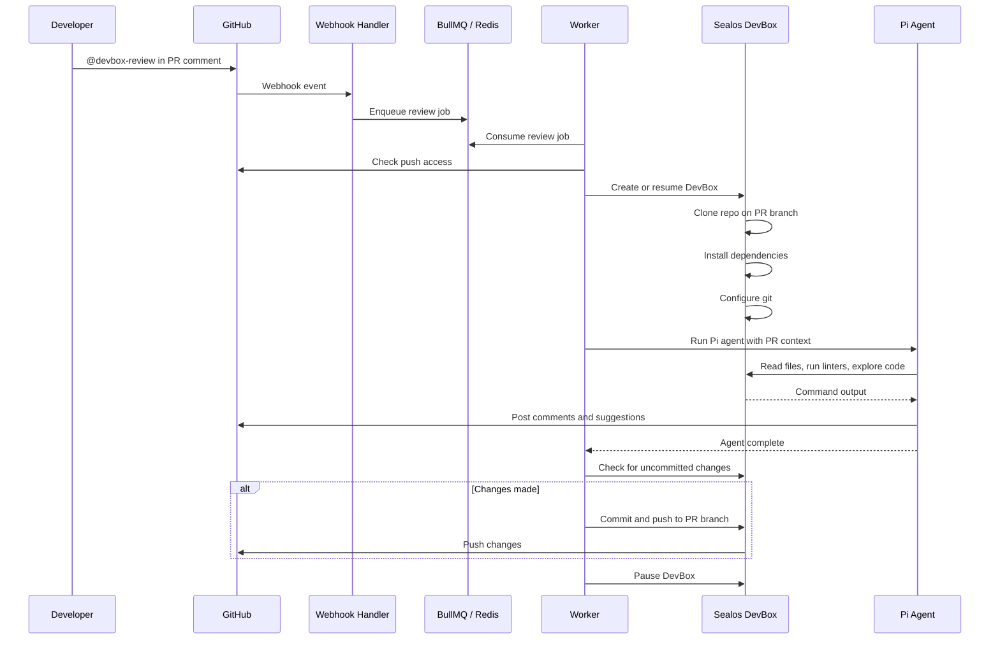

# DevBox Review

An open-source, self-hosted AI PR review bot powered by Sealos DevBox runtimes. Connect a GitHub App, mention the bot in a pull request, and run review agents inside an isolated DevBox with real repository access.

> **Beta**: DevBox Review is early-stage. The core direction is stable: GitHub-native PR review, agentic code execution, and Sealos DevBox as the runtime boundary.

## Why DevBox Review

- **Executable reviews** — The agent can inspect code, run project tooling, edit files, and push fixes back to the PR branch.
- **Sealos DevBox runtime** — Each review runs in an isolated DevBox instead of a hosted sandbox tied to a single vendor.
- **GitHub-native queue** — Trigger reviews from PR comments and process them asynchronously with BullMQ workers.
- **Self-hosted by default** — Run it in your own environment with your own GitHub App, model key, and Sealos DevBox access.
- **Extensible skills** — Ship trusted, domain-specific Pi skills with the review service.

## How it works



1. Mention your GitHub App bot in a PR comment, for example `@devbox-review`.
2. The webhook handler enqueues a BullMQ job in Redis and returns quickly.
3. A worker creates or resumes a Sealos DevBox and clones the PR branch.
4. A Pi agent using OpenAI reviews the diff, explores the codebase, and runs project tooling through DevBox tools.
5. The agent posts findings as PR comments and can include GitHub suggestion blocks.
6. If changes are made, they are committed and pushed to the PR branch.
7. The DevBox is paused after the job finishes.

## Setup

### 1. Run locally with Docker Compose

Copy `.env.example` to `.env` and fill in real credentials:

```bash
cp .env.example .env
```

Start Redis, the webhook server, and the background worker:

```bash
docker compose up --build
```

The app listens on port `3000`. Expose the local webhook endpoint through a public tunnel:

```text
http://localhost:3000/api/webhooks
```

Configure your GitHub App webhook URL to the public tunnel URL:

```text
https://your-tunnel-domain.example/api/webhooks
```

### 2. Deploy with Docker

Build separate images for the webhook server and background worker:

```bash
docker build --target web -t devbox-review-web .
docker build --target worker -t devbox-review-worker .
```

Run the web container to receive GitHub webhooks. Mount the Sealos kubeconfig
as a file and point `DEVBOX_KUBECONFIG_PATH` at the path inside the container:

```bash
docker run --rm -p 3000:3000 \
  -v /path/to/devbox-kubeconfig.yaml:/run/secrets/devbox-kubeconfig:ro \
  -e OPENAI_API_KEY="your-openai-api-key" \
  -e OPENAI_BASE_URL="https://api.openai.com/v1" \
  -e OPENREVIEW_MODEL_PROVIDER="openai" \
  -e OPENREVIEW_MODEL="gpt-5.1" \
  -e REDIS_URL="redis://redis:6379" \
  -e DEVBOX_KUBECONFIG_PATH="/run/secrets/devbox-kubeconfig" \
  -e DEVBOX_JWT_SIGNING_KEY="your-devbox-jwt-signing-key" \
  -e GITHUB_APP_ID="your-github-app-id" \
  -e GITHUB_APP_PRIVATE_KEY="your-private-key-with-newlines-escaped" \
  -e GITHUB_APP_WEBHOOK_SECRET="your-webhook-secret" \
  devbox-review-web web
```

Run at least one worker container against the same Redis instance:

```bash
docker run --rm \
  -v /path/to/devbox-kubeconfig.yaml:/run/secrets/devbox-kubeconfig:ro \
  -e OPENAI_API_KEY="your-openai-api-key" \
  -e OPENAI_BASE_URL="https://api.openai.com/v1" \
  -e OPENREVIEW_MODEL_PROVIDER="openai" \
  -e OPENREVIEW_MODEL="gpt-5.1" \
  -e REDIS_URL="redis://redis:6379" \
  -e DEVBOX_KUBECONFIG_PATH="/run/secrets/devbox-kubeconfig" \
  -e DEVBOX_JWT_SIGNING_KEY="your-devbox-jwt-signing-key" \
  -e GITHUB_APP_ID="your-github-app-id" \
  -e GITHUB_APP_PRIVATE_KEY="your-private-key-with-newlines-escaped" \
  -e GITHUB_APP_WEBHOOK_SECRET="your-webhook-secret" \
  devbox-review-worker worker
```

The app listens on port `3000`. When running behind a public domain or tunnel, configure your GitHub App webhook URL as:

```text
https://your-domain.example/api/webhooks
```

`REDIS_URL` is required by both roles. The web container receives webhooks and enqueues jobs; worker containers process them asynchronously. GitHub App installation IDs are read from signed webhook payloads and persisted with thread/job state, so you do not configure them manually.

### 3. Create a GitHub App

Create a new [GitHub App](https://github.com/settings/apps/new) with the following configuration:

**Webhook URL**: `https://your-domain.example/api/webhooks`

**Repository permissions**:

- Contents: Read and write
- Issues: Read and write
- Pull requests: Read and write
- Metadata: Read-only

**Subscribe to events**:

- Issue comment
- Pull request review comment

Generate a private key and webhook secret, then note your App ID. Installation IDs are read automatically from GitHub webhook payloads.

### 4. Configure environment variables

Copy `.env.example` to `.env` for local development and fill in the values for
your own GitHub App, Sealos kubeconfig, Redis, and OpenAI account. The
kubeconfig current context must include the namespace where DevBox Review should
create runtimes and a bearer token for that cluster.

| Variable                          | Description                                                           |
| --------------------------------- | --------------------------------------------------------------------- |
| `OPENAI_API_KEY`                  | API key for the OpenAI model used by Pi                               |
| `OPENAI_BASE_URL`                 | Optional OpenAI-compatible API base URL for gateways or proxies       |
| `OPENREVIEW_MODEL_PROVIDER`       | Model provider for Pi, defaults to `openai`                           |
| `OPENREVIEW_MODEL`                | Model name for Pi, defaults to `gpt-5.1`                              |
| `OPENREVIEW_WORKER_CONCURRENCY`   | Worker concurrency, defaults to `1`                                   |
| `OPENREVIEW_JOB_ATTEMPTS`         | BullMQ retry attempts, defaults to `3`                                |
| `OPENREVIEW_JOB_BACKOFF_MS`       | BullMQ exponential backoff base delay, defaults to `30000`            |
| `DEVBOX_KUBECONFIG_PATH`          | Path to a Sealos kubeconfig file                                      |
| `DEVBOX_JWT_SIGNING_KEY`          | Signing key used to create namespace-scoped DevBox API JWTs           |
| `DEVBOX_JWT_TTL_SECONDS`          | Optional DevBox JWT TTL, defaults to 4 hours                          |
| `DEVBOX_ARCHIVE_AFTER_PAUSE_TIME` | Optional DevBox archive policy, defaults to `24h`                     |
| `DEVBOX_PAUSE_AFTER_MINUTES`      | Optional runtime lease duration, defaults to `300`                    |
| `DEVBOX_COMMAND_TIMEOUT_SECONDS`  | Optional default command timeout, defaults to `60`                    |
| `GITHUB_APP_ID`                   | The ID of your GitHub App                                             |
| `GITHUB_APP_PRIVATE_KEY`          | The private key generated for your GitHub App, with `\n` for newlines |
| `GITHUB_APP_WEBHOOK_SECRET`       | The webhook secret you configured                                     |
| `REDIS_URL`                       | Redis URL for BullMQ jobs and persistent chat state                   |

### 5. Install the GitHub App

Install the GitHub App on the repositories you want DevBox Review to monitor. Once installed, mention the app bot in any PR comment to trigger a review.

## Usage

Trigger a review by mentioning your GitHub App bot in a PR comment:

```text
@devbox-review check for security vulnerabilities
@devbox-review run the linter and fix any issues
@devbox-review explain how the authentication flow works
```

React with thumbs up or heart on a DevBox Review comment to approve and apply its suggestions. React with thumbs down or confused to skip.

## Skills

DevBox Review uses Pi's native progressive skill system: the agent sees skill names and descriptions up front, then reads the full `SKILL.md` only when the task matches. Skills are loaded from the review service's trusted `.agents/skills/` directory at worker runtime.

PR branches are not treated as a trusted skill source. A pull request can still contain its own `.agents/skills/` files, but OpenReview does not automatically load those files into the reviewer agent because that would let untrusted PR code change review instructions.

Create a folder in `.agents/skills/` with a `SKILL.md` file containing YAML frontmatter:

```text
.agents/skills/
└── my-custom-skill/
    └── SKILL.md
```

```markdown
---
name: my-custom-skill
description: When to use this skill.
---

# My Custom Skill

Your specialized review instructions here.
```

## Tech stack

- [Next.js](https://nextjs.org) — App framework
- [BullMQ](https://docs.bullmq.io/) — Redis-backed async job queue
- [Pi](https://pi.dev/) — Coding agent runtime
- Sealos DevBox — Isolated code execution
- OpenAI — Default model provider
- [Chat SDK](https://www.npmjs.com/package/chat) — GitHub webhook handling
- [Octokit](https://github.com/octokit/octokit.js) — GitHub API client

## Development

For local Docker development, use Compose:

```bash
cp .env.example .env
docker compose up --build
```

For local Bun development, start Redis first:

```bash
docker run --rm -p 6379:6379 redis:7-alpine
```

Install dependencies and start the Next.js webhook/UI process:

```bash
bun install
bun run dev
```

Run a worker in a second terminal:

```bash
bun run worker
```

For a full local integration test:

1. Copy `.env.example` to `.env` and fill in real credentials.
2. Start Redis, `bun run dev`, and `bun run worker`.
3. Expose `http://localhost:3000/api/webhooks` through a public tunnel.
4. Configure the GitHub App webhook URL to the tunnel URL.
5. Install the GitHub App on a test repository.
6. Open a pull request and mention the app bot in a PR comment.
7. Watch the worker logs for DevBox creation, dependency install, Pi execution, and GitHub comment or push results.

Without real GitHub App, DevBox, Redis, and OpenAI credentials, local testing is limited to build/type/lint checks and worker startup validation.

Useful checks:

```bash
bun run check
bun run build
```

## Attribution

DevBox Review is based on [Vercel Labs OpenReview](https://github.com/vercel-labs/openreview), which is licensed under MIT. This project replaces the Vercel Sandbox runtime with Sealos DevBox and evolves independently.

## License

MIT
