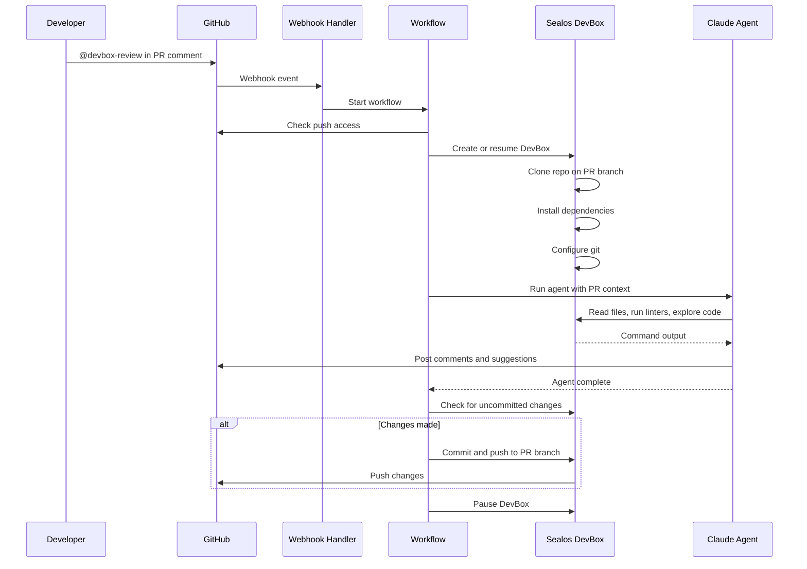

# DevBox Review

An open-source, self-hosted AI PR review bot powered by Sealos DevBox runtimes. Connect a GitHub App, mention the bot in a pull request, and run review agents inside an isolated DevBox with real repository access.

> **Beta**: DevBox Review is early-stage. The core direction is stable: GitHub-native PR review, agentic code execution, and Sealos DevBox as the runtime boundary.

## Why DevBox Review

- **Executable reviews** — The agent can inspect code, run project tooling, edit files, and push fixes back to the PR branch.
- **Sealos DevBox runtime** — Each review runs in an isolated DevBox instead of a hosted sandbox tied to a single vendor.
- **GitHub-native workflow** — Trigger reviews from PR comments and receive normal GitHub comments, suggestions, commits, and pushes.
- **Self-hosted by default** — Run it in your own environment with your own GitHub App, model key, and Sealos DevBox access.
- **Extensible skills** — Add domain-specific review instructions through `.agents/skills/`.

## How it works



1. Mention your GitHub App bot in a PR comment, for example `@devbox-review`.
2. DevBox Review creates or resumes a Sealos DevBox and clones the PR branch.
3. A Claude-powered agent reviews the diff, explores the codebase, and runs project tooling.
4. The agent posts findings as PR comments and can include GitHub suggestion blocks.
5. If changes are made, they are committed and pushed to the PR branch.
6. The DevBox is paused after the workflow finishes.

## Setup

### 1. Deploy with Docker

```bash
docker build -t devbox-review .
docker run --rm -p 3000:3000 \
  -e ANTHROPIC_API_KEY="your-anthropic-api-key" \
  -e DEVBOX_API_BASE_URL="https://devbox-api.example.com" \
  -e DEVBOX_NAMESPACE="your-sealos-namespace" \
  -e DEVBOX_TOKEN="your-devbox-api-token" \
  -e GITHUB_APP_ID="your-github-app-id" \
  -e GITHUB_APP_INSTALLATION_ID="your-github-app-installation-id" \
  -e GITHUB_APP_PRIVATE_KEY="your-private-key-with-newlines-escaped" \
  -e GITHUB_APP_WEBHOOK_SECRET="your-webhook-secret" \
  devbox-review
```

The app listens on port `3000`. When running behind a public domain or tunnel, configure your GitHub App webhook URL as:

```text
https://your-domain.example/api/webhooks
```

`REDIS_URL` is optional. Without it, DevBox Review uses in-memory state, which is lost when the container restarts.

### 2. Create a GitHub App

Create a new [GitHub App](https://github.com/settings/apps/new) with the following configuration:

**Webhook URL**: `https://your-domain.example/api/webhooks`

**Repository permissions**:

- Contents: Read and write
- Issues: Read and write
- Pull requests: Read and write
- Metadata: Read-only

**Subscribe to events**:

- Issue comment
- Pull request review comment

Generate a private key and webhook secret, then note your App ID and installation ID.

### 3. Configure environment variables

| Variable                          | Description                                                            |
| --------------------------------- | ---------------------------------------------------------------------- |
| `ANTHROPIC_API_KEY`               | API key for Claude                                                     |
| `DEVBOX_API_BASE_URL`             | Base URL for the Sealos DevBox API                                     |
| `DEVBOX_NAMESPACE`                | Namespace where DevBox Review creates DevBox runtimes                  |
| `DEVBOX_TOKEN`                    | Static DevBox API bearer token. Optional if JWT signing is configured  |
| `DEVBOX_JWT_SIGNING_KEY`          | Signing key for namespace-scoped DevBox JWTs. Required without token   |
| `DEVBOX_JWT_TTL_SECONDS`          | Optional DevBox JWT TTL, defaults to 4 hours                           |
| `DEVBOX_RUNTIME_IMAGE`            | Optional DevBox image for agent runtimes                               |
| `DEVBOX_ARCHIVE_AFTER_PAUSE_TIME` | Optional DevBox archive policy, defaults to `24h`                      |
| `DEVBOX_PAUSE_AFTER_MINUTES`      | Optional runtime lease duration, defaults to `300`                     |
| `DEVBOX_COMMAND_TIMEOUT_SECONDS`  | Optional default command timeout, defaults to `60`                     |
| `GITHUB_APP_ID`                   | The ID of your GitHub App                                              |
| `GITHUB_APP_INSTALLATION_ID`      | The installation ID for your repository                                |
| `GITHUB_APP_PRIVATE_KEY`          | The private key generated for your GitHub App, with `\n` for newlines  |
| `GITHUB_APP_WEBHOOK_SECRET`       | The webhook secret you configured                                      |
| `REDIS_URL`                       | Optional Redis URL for persistent state, falls back to in-memory state |

### 4. Install the GitHub App

Install the GitHub App on the repositories you want DevBox Review to monitor. Once installed, mention the app bot in any PR comment to trigger a review.

## Usage

Trigger a review by mentioning your GitHub App bot in a PR comment:

```text
@devbox-review check for security vulnerabilities
@devbox-review run the linter and fix any issues
@devbox-review explain how the authentication flow works
```

React with thumbs up or heart on a DevBox Review comment to approve and apply its suggestions. React with thumbs down or confused to skip.

## Skills

DevBox Review uses a progressive skill system: the agent only loads specialized instructions when relevant, keeping context focused and reviews thorough. Skills are discovered from `.agents/skills/` at runtime.

Create a folder in `.agents/skills/` with a `SKILL.md` file containing YAML frontmatter:

```text
.agents/skills/
└── my-custom-skill/
    └── SKILL.md
```

```markdown
---
name: my-custom-skill
description: When to use this skill.
---

# My Custom Skill

Your specialized review instructions here.
```

## Tech stack

- [Next.js](https://nextjs.org) — App framework
- [Workflow](https://www.npmjs.com/package/workflow) — Durable execution
- Sealos DevBox — Isolated code execution
- [AI SDK](https://sdk.vercel.ai) — AI model integration
- [Chat SDK](https://www.npmjs.com/package/chat) — GitHub webhook handling
- [Octokit](https://github.com/octokit/octokit.js) — GitHub API client

## Development

```bash
bun install
bun run dev
```

Useful checks:

```bash
bun run check
bun run build
```

## Attribution

DevBox Review is based on [Vercel Labs OpenReview](https://github.com/vercel-labs/openreview), which is licensed under MIT. This project replaces the Vercel Sandbox runtime with Sealos DevBox and evolves independently.

## License

MIT
